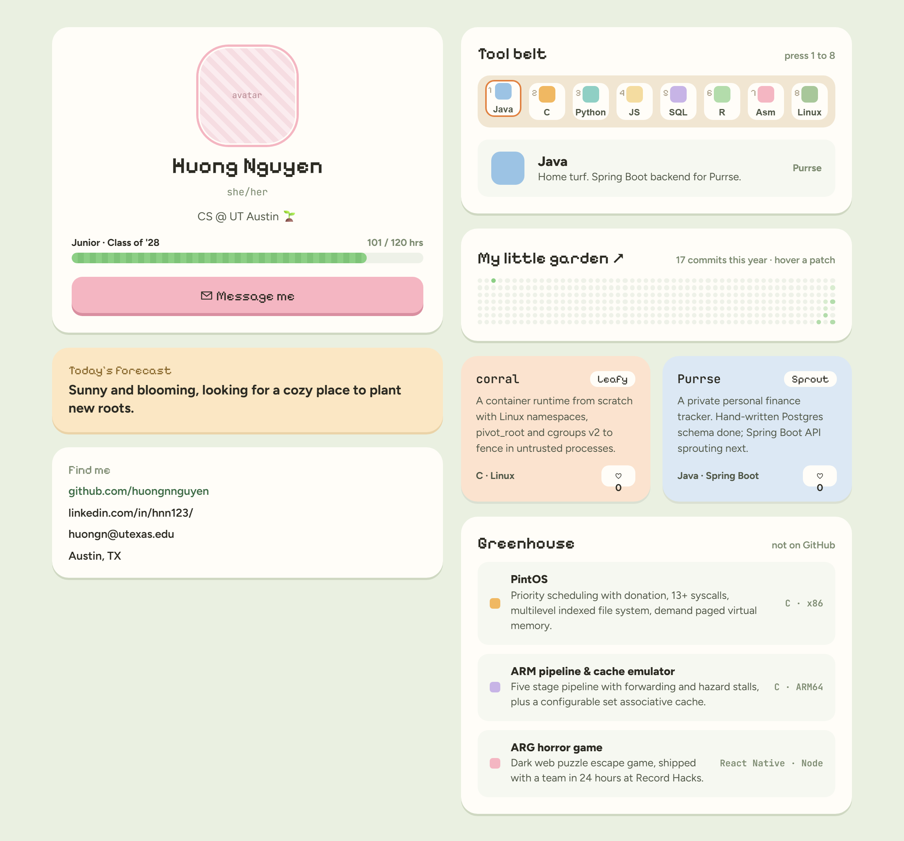
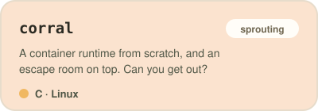
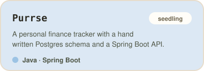

  

<h2 align="center">⋆. 𐙚˚࿔ Hi, I'm Huong! ₍^. .^₎⟆ 𝜗𝜚˚⋆</h2>

  CS junior at UT Austin, minoring in Statistics &amp; Data Science. 
  I like systems work, backend stuff, and building small things that run well.

  
  
  

 

<h3 align="center"> Tools </h3>

  
  
  
  
  
  
  
  
  
  
  
  
  

 

<h3 align="center"> Projects </h3>

  
  

Also built, just not on GitHub: a PintOS kernel, an ARM pipeline + cache emulator, and a 24 hour hackathon horror game

 

<h3 align="center"> Garden </h3>

  

˚ʚ♡ɞ˚ Thanks for stopping by! ˚ʚ♡ɞ˚

